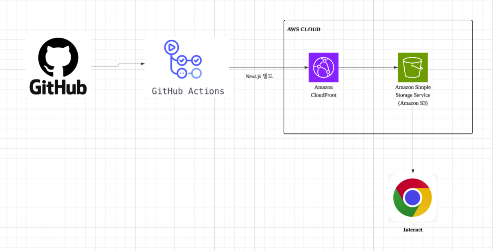
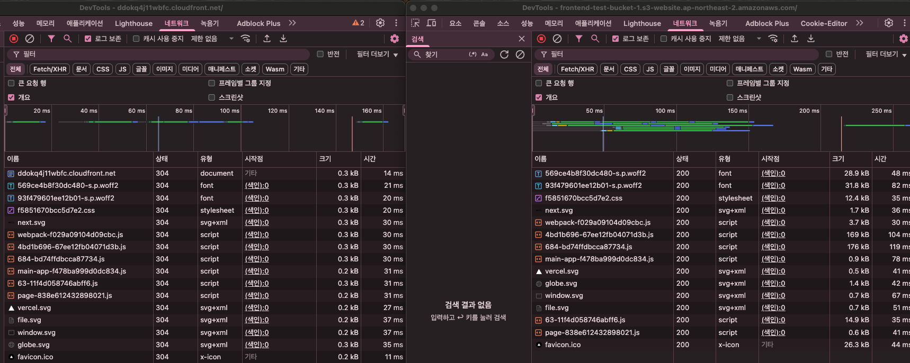
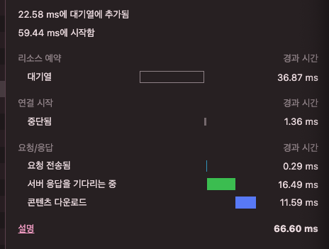
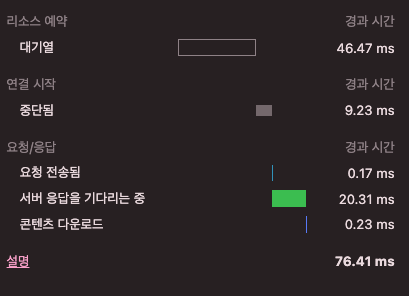
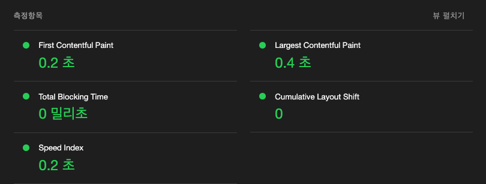
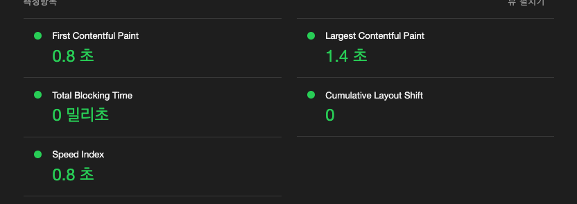

# 프론트엔드 인프라 최적화 하기

## 개요

1. Checkout 액션을 사용해 코드 내려받기
2. `npm ci` 명령어로 프로젝트 의존성 설치
3. `npm run build` 명령어로 Next.js 프로젝트 빌드
4. AWS 자격 증명 구성
5. 빌드된 파일을 S3 버킷에 동기화
6. CloudFront 캐시 무효화

## 목표

- s3, cloudfront, github action을 사용해서 next 프로젝트를 배포한다.
- 워크 플로우에서 캐시 무효화가 어느 시점에서 동작하는지 알아본다.
- 과제에서 사용된 것들의 개념을 정리한다.
- CDN을 적용하기 전과 후의 성능보고서를 만든다.

## 링크

- S3 버킷 웹사이트 엔드포인트
  http://frontend-test-bucket-1.s3-website.ap-northeast-2.amazonaws.com/

- 클라우드 프론트 엔드포인트
  https://ddokq4j11wbfc.cloudfront.net

 
 
 

### 다이어그램

1단계: 코드 푸시 (GitHub)
개발자가 Next.js 프로젝트 코드를 GitHub 저장소에 푸시합니다.

2단계: 자동 빌드 트리거 (GitHub Actions)
GitHub에 코드가 푸시되면 GitHub Actions 워크플로우가 자동으로 실행됩니다

3단계: S3 업로드 (Amazon S3)
빌드된 정적 파일들(out/ 디렉토리)을 Amazon S3 버킷에 업로드합니다

4단계: CDN 배포 (Amazon CloudFront)
CloudFront가 S3 버킷을 오리진으로 설정하여 전 세계 엣지 로케이션에 콘텐츠를 캐시합니다

5단계: 사용자 접근 (Chrome/Internet)
최종 사용자가 브라우저(Chrome)를 통해 웹사이트에 접근합니다

CloudFront를 통해 캐시된 콘텐츠를 빠르게 로드받습니다

# 개념정리

### GitHub Actions과 CI/CD 도구

GitHub Actions는 GitHub에서 제공하는 **네이티브 CI/CD 도구**로, 개발자들이 코드 저장소에서 직접 빌드, 테스트, 배포를 자동화할 수 있게 해줍니다. **이벤트 기반**으로 동작하며, push, pull request, 이슈 생성 등 GitHub에서 발생하는 모든 웹훅 이벤트에 대응하여 워크플로우를 실행할 수 있습니다.

### 핵심 특징

- **간편한 설정**: 별도의 하드웨어나 인스턴스 설정 없이 `.github/workflows` 디렉토리에 YAML 파일만 추가하면 됩니다
- **플랫폼 독립성**: 모든 플랫폼, 언어, 클라우드 환경을 지원합니다
- **커뮤니티 기반**: GitHub Marketplace에서 **11,000개 이상**의 사전 구축된 액션을 재사용할 수 있습니다
- **호스팅 가상머신**: Ubuntu Linux, Windows, macOS 환경에서 코드를 빌드, 테스트, 배포할 수 있습니다

### CI/CD 파이프라인 구성요소

| 구성요소          | 설명                                    |
| ----------------- | --------------------------------------- |
| **워크플로우**    | 자동화된 프로세스를 정의하는 YAML 파일  |
| **잡(Jobs)**      | 워크플로우 내에서 실행되는 작업 단위    |
| **스텝(Steps)**   | 잡 내에서 순차적으로 실행되는 개별 작업 |
| **액션(Actions)** | 재사용 가능한 코드 단위                 |

 
 
 

## S3와 스토리지

Amazon S3(Simple Storage Service)는 **객체 스토리지 서비스**로, 업계 최고 수준의 확장성, 데이터 가용성, 보안, 성능을 제공합니다. 웹 애플리케이션, 모바일 앱, 데이터 레이크 등 다양한 용도로 사용됩니다.

### 핵심 개념

- **객체(Objects)**: 파일과 해당 파일을 설명하는 메타데이터로 구성됩니다
- **버킷(Buckets)**: 객체를 담는 컨테이너로, 고유한 이름과 AWS 리전을 가집니다
- **키(Key)**: 버킷 내에서 객체를 고유하게 식별하는 이름입니다

### 주요 특징

- **무제한 확장성**: 엑사바이트까지 데이터 저장 가능하며, 개별 객체는 최대 **5TB**까지 지원합니다
- **높은 내구성**: **99.999999999%(11 nines)**의 데이터 내구성을 제공합니다
- **다양한 스토리지 클래스**: 액세스 패턴에 따라 비용을 최적화할 수 있는 여러 스토리지 클래스를 제공합니다
- **보안**: 기본적으로 암호화되며, 버킷 정책, IAM 정책, ACL 등으로 접근을 제어할 수 있습니다

 
 
 

## CloudFront와 CDN

Amazon CloudFront는 전 세계에 분산된 **엣지 로케이션 네트워크**를 통해 정적 및 동적 웹 콘텐츠의 배포를 가속화하는 **CDN(Content Delivery Network)** 서비스입니다. 사용자의 지리적 위치에서 가장 가까운 엣지 서버에서 콘텐츠를 제공하여 지연 시간을 최소화합니다.

### CDN 작동 원리

- **캐싱**: 정적 웹 콘텐츠의 복사본을 여러 서버에 저장하여 빠른 데이터 액세스를 제공합니다
- **동적 가속**: 중간 CDN 서버를 통해 동적 웹 콘텐츠 요청의 서버 응답 시간을 단축합니다
- **엣지 로직 연산**: 엣지 서버에서 논리적 연산을 수행하여 클라이언트와 서버 간 통신을 최적화합니다

### CloudFront 핵심 기능

| 기능                   | 설명                                                           |
| ---------------------- | -------------------------------------------------------------- |
| **오리진 서버**        | S3 버킷이나 HTTP 서버 등 원본 콘텐츠를 저장하는 서버를 지정    |
| **배포(Distribution)** | CloudFront가 콘텐츠를 가져올 오리진 서버를 지정하는 설정       |
| **TTL 설정**           | 콘텐츠가 엣지 로케이션에 캐시되는 시간을 제어 (기본 24시간)    |
| **도메인 이름**        | CloudFront가 제공하는 도메인 또는 사용자 정의 도메인 사용 가능 |

 
 
 

## 캐시 무효화(Cache Invalidation)

캐시 무효화는 컴퓨터 시스템에서 **캐시의 항목을 교체하거나 제거**하는 프로세스입니다. 새로운 콘텐츠를 클라이언트에게 전달하기 위해 오래된 캐시 데이터를 업데이트하는 방법입니다.

### 무효화 방법

### **Purge**

캐싱 프록시에서 콘텐츠를 즉시 제거합니다. 클라이언트가 다시 요청하면 애플리케이션에서 새로 가져와 캐시에 저장합니다.

### **Refresh**

캐시된 콘텐츠가 있어도 애플리케이션에서 새로운 콘텐츠를 가져와 기존 캐시를 교체합니다.

### **Ban**

캐시된 콘텐츠를 블랙리스트에 추가하여, 클라이언트 요청 시 새로운 콘텐츠를 가져오도록 합니다.

### CloudFront 무효화 특징

- **대소문자 구분**: 무효화 경로는 대소문자를 구분합니다
- **전체 버전 무효화**: 파일을 무효화하면 쿠키나 헤더와 관련된 모든 캐시 버전이 무효화됩니다
- **와일드카드 지원**: `/*` 패턴을 사용하여 모든 파일을 무효화할 수 있습니다

 
 
 

## Repository Secret과 환경변수

GitHub Secrets는 **API 키, 토큰, 비밀번호** 같은 민감한 정보를 저장소에 안전하게 저장하는 기능입니다. 코드에 하드코딩하지 않고도 워크플로우에서 안전하게 사용할 수 있습니다.

## Secret 유형

| 유형                     | 범위        | 설명                                                           |
| ------------------------ | ----------- | -------------------------------------------------------------- |
| **Repository Secrets**   | 저장소 단위 | 특정 저장소에서만 사용 가능한 비밀 정보                        |
| **Environment Secrets**  | 환경 단위   | 특정 환경(예: production, staging)에서만 사용 가능한 비밀 정보 |
| **Organization Secrets** | 조직 단위   | 조직 전체에서 공유되는 비밀 정보                               |

## 환경변수 설정

- **전역 레벨**: 모든 잡에서 접근 가능한 환경변수를 설정할 수 있습니다
- **잡 레벨**: 특정 잡에서만 접근 가능한 환경변수를 설정할 수 있습니다
- **스텝 레벨**: 개별 스텝에서만 사용되는 환경변수를 설정할 수 있습니다

## 보안 특징

- **Libsodium 암호화**: GitHub은 **Libsodium sealed boxes**를 사용하여 비밀 정보를 암호화합니다
- **제한된 접근**: 각 서비스(Dependabot, GitHub Actions, Codespaces)별로 접근 권한이 분리되어 있습니다
- **크기 제한**: 비밀 정보는 최대 **48KB**까지 저장할 수 있습니다

 
 
 

## CDN 도입 전과 도입 후의 성능 개선 보고서

### 네트워크 불러오는 속도

좌측 : 클라우드 프론트
우측 : s3 링크
로딩 시간 비교

CDN : 총 로딩 시간이 약 160ms 내외로 완료

S3 직접 접근 : 총 로딩 시간이 약 250ms 이상으로 연장

리소스별 성능 차이
CDN을 통한 접근에서 대부분의 정적 리소스(CSS, JS, 이미지, SVG 파일)들이 20-30ms 범위 내에서 로딩되는 반면, S3 직접 접근에서는 30-100ms 이상의 시간이 소요되고 있음.

 

---

### 파일 크기와 전송 효율성

동일한 파일들이 CDN에서는 더 빠른 응답 시간을 보여주고 있음

특히 큰 용량의 JavaScript 파일들(webpack 번들 등)에서 성능 차이가 두드러짐

 

---

### 성능 개선 효과

CDN 사용으로 인한 주요 개선 사항:

전체 페이지 로딩 시간 약 35% 단축

정적 리소스 응답 시간 평균 50% 개선

 

---

### 좌 클라우드프론트 웹팩 타이밍 / 우 : s3 타이밍

  

 

**대기열(Queueing)**:
두 리소스 모두 대기열에서 가장 많은 시간이 소요됨(36.87ms vs 46.47ms). 이는 브라우저의 동시 요청 제한, 네트워크 혼잡, 또는 이전 요청 대기 등 다양한 원인에 의해 발생할 수 있습니다.

**연결 시작(Connecting)**:
좌측(1.36ms)에 비해 우측(9.23ms)이 더 오래 걸림. 이는 TCP 핸드셰이크, SSL/TLS 협상 등 네트워크 연결 단계에서의 지연을 의미합니다.

**서버 응답 대기(TTFB)**:
좌측(16.49ms), 우측(20.31ms) 모두 서버 처리 및 네트워크 왕복 시간에 해당. 서버 위치, 캐싱 여부, 네트워크 경로 등에 따라 차이가 발생할 수 있습니다.

**콘텐츠 다운로드**:
좌측(11.59ms)은 우측(0.23ms)보다 다운로드 시간이 훨씬 길었습니다. 이는 파일 크기 차이, 네트워크 속도, CDN 캐시 여부 등에 따라 달라질 수 있습니다.

**총 소요 시간\***:
좌측(66.60ms)이 우측(76.41ms)보다 약 10ms 빠름. 전체적으로 대기열과 연결, 응답 대기에서의 차이가 전체 성능에 영향을 줍니다.

 

### 라이트하우스 클라우드 프론트

### 라이트하우스 S3

라이트 하우스에서는 성능, 접근성, 권장사항, 검색엔지 최적화를 평가하지만 이번에는 성능에서만 비교를 해야하기 때문에 다른 항목들은 제외했습니다. CloudFront(CDN) 사용 시 페이지 주요 콘텐츠가 훨씬 빠르게 표시됩니다. 페이지에 내용이 없어서
차이를 크게 느끼지 못하지만, 만약 표현해야할 내용이 많아지면 많아질수록 격차는 더 심해질 것으로 보입니다.
